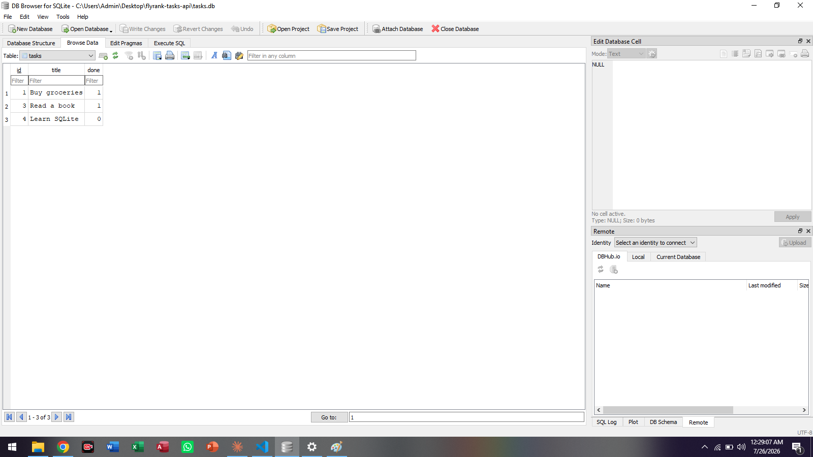

# FlyRank Tasks API

A simple CRUD Task API built for the FlyRank AI Internship (Backend AI Engineering track, Assignment A2 — Connecting your CRUD to the database).

## About

This project takes a basic in-memory CRUD API and connects it to a real SQLite database, so tasks now survive server restarts.

## Why SQLite?

SQLite was chosen because it requires no separate server or installation — it's just a single file (`tasks.db`) that stores all the data. It's perfect for small projects and learning how databases work.

## Where the database lives

The database file is `tasks.db`, created automatically the first time the app runs. It is usually git-ignored so each clone starts fresh with 3 example tasks.

## How to run

1. Install dependencies:
pip install flask
2. Run the server:
python app.py
3. Visit `http://localhost:3000/tasks`

## Endpoints

- `GET /tasks` — list all tasks
- `GET /tasks/:id` — get one task
- `POST /tasks` — create a new task
- `PUT /tasks/:id` — update a task
- `DELETE /tasks/:id` — delete a task

## Example SQL query I ran

```sql
SELECT * FROM tasks WHERE done = 1;
```

This returned all tasks marked as completed.

## Database screenshot



## Author

Fatima Hamid — BS Biostatistics, University of the Punjab